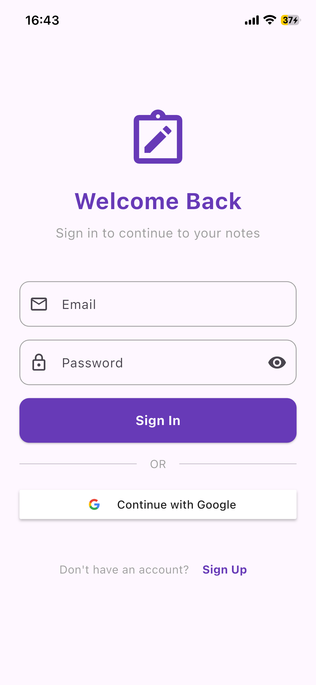
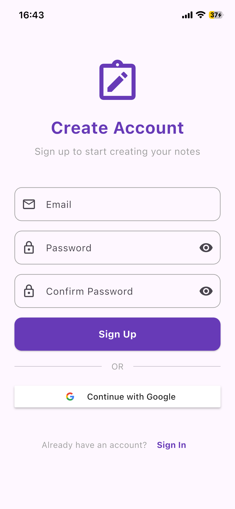
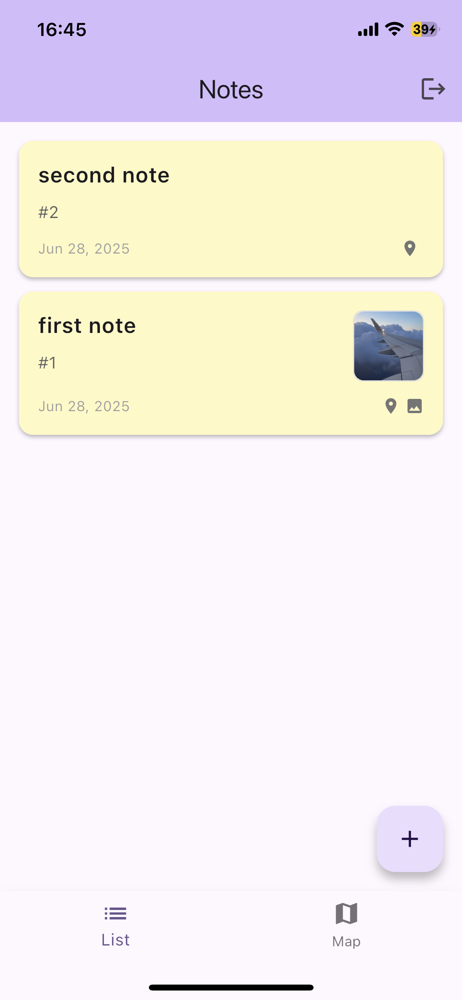
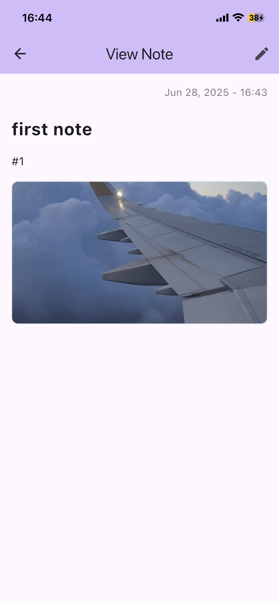
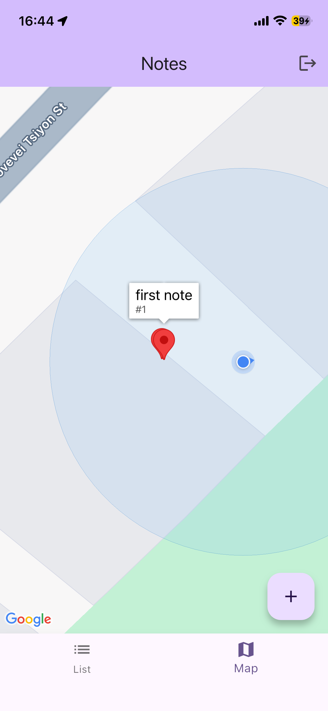

# 📝 Notes App

A modern Flutter application for creating and managing notes with location support, built using the MVVM design pattern and featuring Firebase authentication, Cloud Firestore, and Google Maps integration.

## ✨ Features

### 🔐 Authentication

- **Google Sign-In**: Seamless authentication with Google accounts
- **Firebase Auth**: Secure user authentication and session management

### 📝 Note Management

- **Create & Edit**: text editing with real-time updates
- **Location Tags**: Automatically capture and store location data
- **Image Support**: Attach images to notes
- **Timestamps**: Automatic creation and modification tracking

### 🗺️ Dual View Modes

- **List View**: All notes sorted by creation date with search functionality
- **Map View**: Interactive Google Maps with note pins and location data

### ☁️ Cloud Integration

- **Firebase Firestore**: Real-time cloud database
- **Supabase**: Additional backend services for storing images

### 🎨 Modern UI/UX

- **Material Design 3**: Latest Material Design guidelines

## 📸 Screenshots

<div align="center">
  <table>
    <tr>
      <td align="center">
        <b>Signin Screen</b><br/>
        
      </td>
      <td align="center">
        <b>Signup Screenshot</b><br/>
        
      </td>
      <td align="center">
        <b>Home Screen - List View</b><br/>
        
      </td>
    </tr>
    <tr>
      <td align="center">
        <b>Note Reading</b><br/>
        
      </td>
      <td align="center">
        <b>Home Screen - Map View</b><br/>
        
      </td>
    </tr>
  </table>
</div>

## 🏗️ Architecture

This app follows the **MVVM (Model-View-ViewModel)** design pattern for clean separation of concerns:

```
┌─────────────────┐    ┌──────────────────┐    ┌─────────────────┐
│      View       │    │   ViewModel      │    │      Model      │
│   (UI Layer)    │◄──►│ (Business Logic) │◄──►│  (Data Layer)   │
└─────────────────┘    └──────────────────┘    └─────────────────┘
```

### Key Components

- **Models**: Data class representing note entity (`Note`)
- **Views**: UI components and screens (`AuthPage`, `HomePage`, `NoteScreen`)
- **ViewModels**: Business logic and state management (`AuthViewModel`, `HomeViewModel`, `NoteViewModel`)
- **Services**: External integrations (`AuthService`, `LocationService`, `NoteService`)
- **Repositories**: Data access layer (`NoteRepository`)

## 🚀 Getting Started

### Prerequisites

- **Flutter SDK**: 3.7.0 or higher
- **Dart SDK**: Latest stable version
- **IDE**: Android Studio, VS Code, or IntelliJ IDEA
- **Firebase Account**: For authentication and database
- **Google Cloud Platform**: For Maps API
- **Supabase Account**: For additional backend services

### Installation

1. **Clone the repository**

   ```bash
   git clone <repository-url>
   cd notes_app
   ```

2. **Install dependencies**

   ```bash
   flutter pub get
   ```

3. **Environment Setup**
   Create a `.env` file in the root directory like shown in the `.env.example`

## 🎯 Key Features Implementation

### Authentication Flow

- Google Sign-In integration
- Automatic session management
- Protected route navigation
- User state persistence

### Note Management

- Real-time Firestore synchronization
- Location data capture
- Image attachment support

### Location Services

- GPS location tracking
- Map pin visualization

### State Management

- Provider pattern implementation
- Reactive UI updates
- Error handling and loading states

## 📱 Platform Support

- **Android**: API level 23+
- **iOS**: iOS 13.0+

**Made with ❤️ using Flutter**
